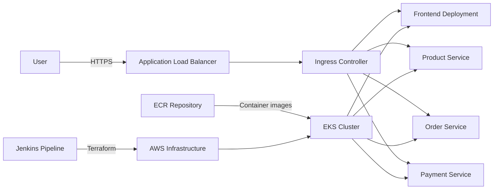

# ecommerce-platform

This project demonstrates a production-style DevOps workflow for provisioning and deploying an ecommerce application on AWS EKS using Terraform, Jenkins, and Kubernetes.

## Architecture Diagram

## Folder Structure

- `terraform/` contains the root module and reusable Terraform modules for networking, IAM, EKS, ECR, and ALB.
- `terraform/backend/` stores the backend configuration for remote state.
- `terraform/envs/dev/` contains the development environment configuration for Terraform.
- `kubernetes/` contains manifests for the application workloads and ingress.
- `Jenkinsfile` defines the CI/CD pipeline that runs Terraform and deploys the application.

## Terraform Workflow

1. Terraform initializes the remote backend in S3 with DynamoDB state locking.
2. Terraform validates and formats the configuration.
3. Terraform generates a plan for the `dev` environment.
4. A manual approval gate can be used before apply or destroy.
5. Terraform provisions the AWS resources defined in the modules.

## Jenkins Pipeline Workflow

The Jenkins declarative pipeline supports:

- `ENVIRONMENT=dev`
- `ACTION=plan|apply|destroy`
- `AUTO_APPROVE=true|false`

The stages are:

1. Checkout Source Code
2. Terraform Version
3. Terraform Format Check
4. Terraform Init
5. Terraform Validate
6. Terraform Plan
7. Manual Approval (when required)
8. Terraform Apply
9. Terraform Destroy

## Remote Backend Configuration

The Terraform remote state is configured with:

- S3 bucket: `vibha-terraform-state`
- Key: `ecommerce/dev/terraform.tfstate`
- DynamoDB table: `terraform-locks`
- Region: `ap-south-1`

## Running Terraform via Jenkins

1. Open the Jenkins job configured for this repository.
2. Set the parameters:
   - `ENVIRONMENT=dev`
   - `ACTION=plan` or `apply` or `destroy`
   - `AUTO_APPROVE=true` for non-interactive execution
3. Trigger the build.

### Plan

- Use `ACTION=plan` to review infrastructure changes.

### Apply

- Use `ACTION=apply` to provision the infrastructure.
- If `AUTO_APPROVE=false`, Jenkins pauses for approval before applying.

### Destroy

- Use `ACTION=destroy` to remove the provisioned infrastructure.
- If `AUTO_APPROVE=false`, Jenkins pauses for approval before destroying.

## Deploying Kubernetes to EKS

After the infrastructure is provisioned:

1. Update the kubeconfig for the EKS cluster:
   `aws eks update-kubeconfig --region ap-south-1 --name $(terraform -chdir=terraform/envs/dev output -raw cluster_name)`
2. Apply the manifests:
   `kubectl apply -f kubernetes/frontend.yaml`
   `kubectl apply -f kubernetes/product-service.yaml`
   `kubectl apply -f kubernetes/order-service.yaml`
   `kubectl apply -f kubernetes/payment-service.yaml`
   `kubectl apply -f kubernetes/ingress.yaml`
3. Check the workload status:
   `kubectl get pods,svc,ingress -A`

## Destroying the Infrastructure

To remove the infrastructure:

1. Run the Jenkins job with `ACTION=destroy`.
2. Or run Terraform locally:
   `terraform -chdir=terraform/envs/dev init -backend-config=../../backend/dev.hcl`
   `terraform -chdir=terraform/envs/dev destroy -var-file=dev.tfvars -auto-approve`

## Notes

- The ALB is provisioned through Terraform and is intended to be used by the Kubernetes ingress controller.
- The ECR repository is created to host application container images for deployment to EKS.
- The configuration is designed for a real-world portfolio and interview demonstration.
